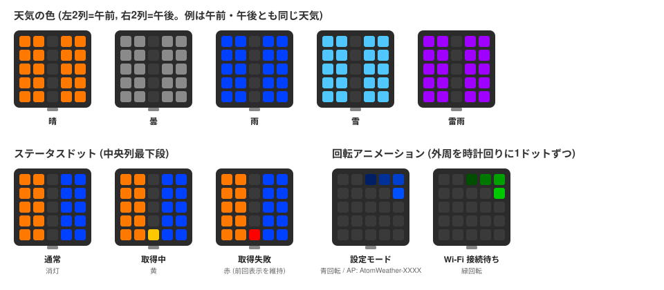

# AtomMatrixWeather

M5Stack **ATOM Matrix** の 5x5 LED に、今日の午前・午後の天気を色で表示するスケッチです。
天気データは [Open-Meteo](https://open-meteo.com/) から取得します(無料・API キー不要)。

## 動作イメージ


## 表示

USB-C コネクタを下にして正面から見た向きが基準です。

```
AM AM ・ PM PM
AM AM ・ PM PM
AM AM ・ PM PM
AM AM ・ PM PM
AM AM ST PM PM
```

- 左2列 … 午前 (6〜12時) の天気
- 右2列 … 午後 (12〜18時) の天気
- `ST` (中央列最下段) … ステータス: 緑=Wi-Fi 再接続中 / 黄=取得中 / 赤=取得失敗(前回の表示を維持)

各時間帯は、時間別の天気コードのうち **最も悪い天気** を採用します。

| 天気 | 色 |
|---|---|
| 晴 | オレンジ |
| 曇 | グレー白 |
| 雨 | 青 |
| 雪 | 水色 |
| 雷雨 | 紫 |

その他の LED パターン:

- **青の回転** … 設定モード (AP モード)
- **緑の回転** … 初回の Wi-Fi 接続待ち(天気表示がある場合は緑ドットで再接続中を示す)

### LED パターン一覧



## 必要なもの

- M5Stack **ATOM Matrix**
- データ通信できる USB-C ケーブル
- (ブラウザから書き込む場合) PC 版の Chrome / Edge
- (自分でビルドする場合) Arduino IDE + M5Stack ボードマネージャ (esp32 core 3.x) と下記ライブラリ
  - M5Unified
  - ArduinoJson (v7)
  - Adafruit NeoPixel

## 書き込みと初期設定

### ブラウザから書き込む (推奨)

Arduino IDE なしで、ビルド済みファームウェアをブラウザから直接書き込めます。

1. ATOM Matrix を USB で PC に接続する
2. PC 版の Chrome / Edge で **インストールページ** <https://atinfinity.github.io/atom-matrix-weather/> を開く
3. 「CONNECT」→ シリアルポートを選択 →「INSTALL」

- Mac で ATOM が認識されない場合は、USB シリアルドライバ (CH9102 / CH552) を [M5Stack のドライバページ](https://docs.m5stack.com/en/download) からインストールしてください
- 設定済みの機体を再インストールする場合、Wi-Fi 設定は保持されます。消したい場合は「Erase device」にチェックを入れてください
- `esptool` で書き込む場合は [Releases](https://github.com/atinfinity/atom-matrix-weather/releases) の `*.merged.bin` を offset `0x0` に書き込みます

### 自分でビルドする場合

`AtomMatrixWeather/AtomMatrixWeather.ino` を Arduino IDE で開き、ボード **M5Atom** を選んで書き込みます。
CI と同じ構成で `arduino-cli` を使う場合は [`.github/workflows/build.yml`](.github/workflows/build.yml) を参照してください。

### 初期設定 (共通)

1. 初回起動時は Wi-Fi 未設定のため自動で設定モードになり、LED が青く回転する
2. スマホ/PC から Wi-Fi `AtomWeather-XXXX` (パスワードなし) に接続する
3. 自動で設定ページが開かない場合は `http://192.168.4.1/` を開く
4. Wi-Fi SSID / パスワード / 都道府県を入力して「保存して再起動」
   - パスワード欄は常に空で表示されます。同じ SSID のまま空欄で保存すると前回のパスワードを維持します(SSID を変えた場合は空=パスワードなしとして保存)

設定は本体の NVS に保存され、電源を切っても保持されます。設定ページの下部に書き込まれているファームウェアのバージョンが表示されます。

## 操作

| 操作 | 動作 |
|---|---|
| ボタン短押し | 天気を即時再取得 |
| ボタン 3 秒長押し | 設定モードに入る |
| ボタンを押しながら電源投入 | 設定モードで起動 |

## 定数 (スケッチ冒頭で変更可能)

| 定数 | 既定値 | 説明 |
|---|---|---|
| `UPDATE_INTERVAL_MS` | 30 分 | 天気の取得間隔 |
| `LED_BRIGHTNESS` | 20 | LED の明るさ (0-255) |
| `ROTATE_180` | 0 | 1 で表示を 180 度回転 (USB を上にして置く場合) |
| `WIFI_CONNECT_TIMEOUT_MS` | 20 秒 | Wi-Fi 接続待ちの上限 |
| `LONG_PRESS_MS` | 3 秒 | 設定モードに入る長押し時間 |
| `WIFI_RETRY_INITIAL_MS` | 10 秒 | 再接続バックオフの初期間隔 (失敗ごとに2倍) |
| `WIFI_RETRY_MAX_MS` | 5 分 | 再接続バックオフの上限 |

## シリアルログ

115200 baud。設定値、取得結果 (午前/午後の判定)、エラー内容を出力します。

## 備考

- HTTPS の証明書検証は省略しています (`setInsecure()`)
- Wi-Fi が切断されると自動で再接続を試みます (10秒→20秒→…→最大5分の間隔)。再接続後、取得間隔を超過していれば即時取得します
- 日付の切り替わりは定期取得のたびに「今日」を要求することで自然に追従します (最大で取得間隔分の遅れ)

## ライセンス

MIT License

## リリース手順 (開発者向け)

`v*` タグを push すると GitHub Actions がビルドし、Release の作成と GitHub Pages (インストールページ) の更新を行います。

```sh
git tag v1.0.0
git push origin v1.0.0
```

main への push / PR ではコンパイルチェックのみ行います。
