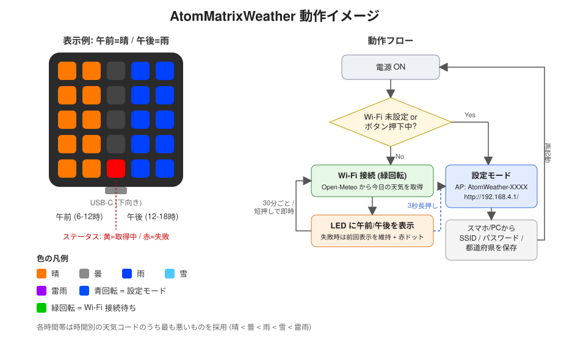

# AtomMatrixWeather

M5Stack **ATOM Matrix** の 5x5 LED に、今日の午前・午後の天気を色で表示するスケッチです。
天気データは [Open-Meteo](https://open-meteo.com/) から取得します(無料・API キー不要)。

## 動作イメージ



## 表示

USB-C コネクタを下にして正面から見た向きが基準です。

```
AM AM ・ PM PM
AM AM ・ PM PM
AM AM ・ PM PM
AM AM ・ PM PM
AM AM ST PM PM
```

- 左2列 … 午前 (6〜12時) の天気
- 右2列 … 午後 (12〜18時) の天気
- `ST` (中央列最下段) … ステータス: 黄=取得中 / 赤=取得失敗(前回の表示を維持)

各時間帯は、時間別の天気コードのうち **最も悪い天気** を採用します。

| 天気 | 色 |
|---|---|
| 晴 | オレンジ |
| 曇 | グレー白 |
| 雨 | 青 |
| 雪 | 水色 |
| 雷雨 | 紫 |

その他の LED パターン:

- **青の回転** … 設定モード (AP モード)
- **緑の回転** … Wi-Fi 接続待ち

## 必要なもの

- Arduino IDE + M5Stack ボードマネージャ (esp32 core 3.x)
- ボード: **M5Atom**
- ライブラリ (ライブラリマネージャからインストール)
  - M5Unified
  - ArduinoJson (v7)
  - Adafruit NeoPixel

## 書き込みと初期設定

1. `AtomMatrixWeather/AtomMatrixWeather.ino` を Arduino IDE で開き、ボード **M5Atom** を選んで書き込む
2. 初回起動時は Wi-Fi 未設定のため自動で設定モードになり、LED が青く回転する
3. スマホ/PC から Wi-Fi `AtomWeather-XXXX` (パスワードなし) に接続する
4. 自動で設定ページが開かない場合は `http://192.168.4.1/` を開く
5. Wi-Fi SSID / パスワード / 都道府県を入力して「保存して再起動」

設定は本体の NVS に保存され、電源を切っても保持されます。

## 操作

| 操作 | 動作 |
|---|---|
| ボタン短押し | 天気を即時再取得 |
| ボタン 3 秒長押し | 設定モードに入る |
| ボタンを押しながら電源投入 | 設定モードで起動 |

## 定数 (スケッチ冒頭で変更可能)

| 定数 | 既定値 | 説明 |
|---|---|---|
| `UPDATE_INTERVAL_MS` | 30 分 | 天気の取得間隔 |
| `LED_BRIGHTNESS` | 20 | LED の明るさ (0-255) |
| `ROTATE_180` | 0 | 1 で表示を 180 度回転 (USB を上にして置く場合) |
| `WIFI_CONNECT_TIMEOUT_MS` | 20 秒 | Wi-Fi 接続待ちの上限 |
| `LONG_PRESS_MS` | 3 秒 | 設定モードに入る長押し時間 |

## シリアルログ

115200 baud。設定値、取得結果 (午前/午後の判定)、エラー内容を出力します。

## 備考

- HTTPS の証明書検証は省略しています (`setInsecure()`)
- 日付の切り替わりは定期取得のたびに「今日」を要求することで自然に追従します (最大で取得間隔分の遅れ)
